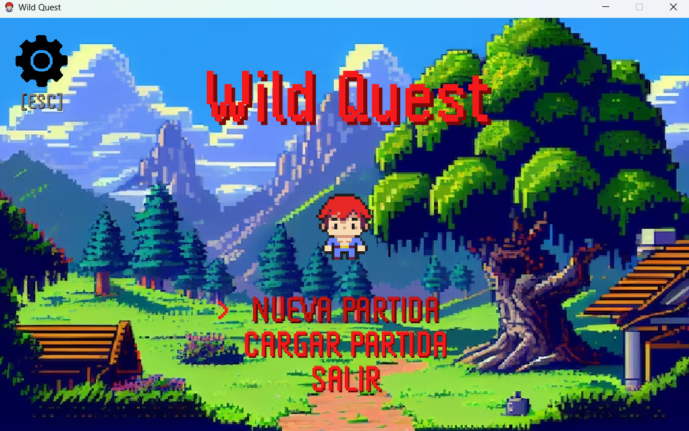
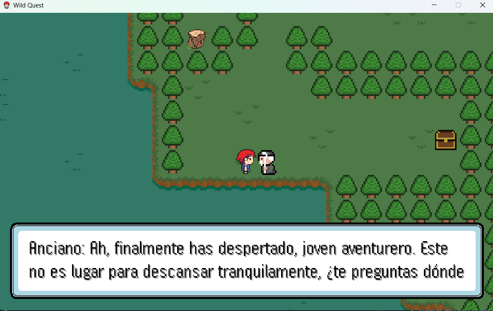
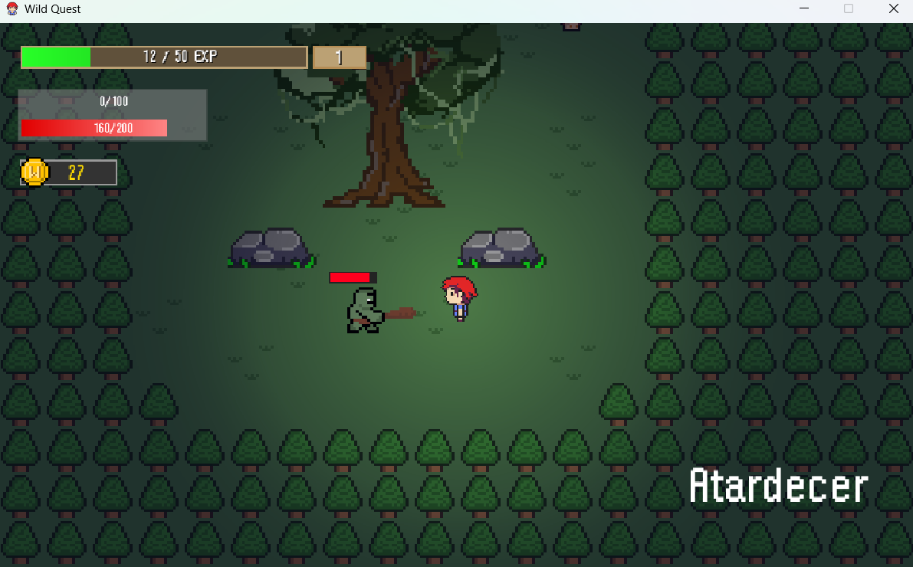
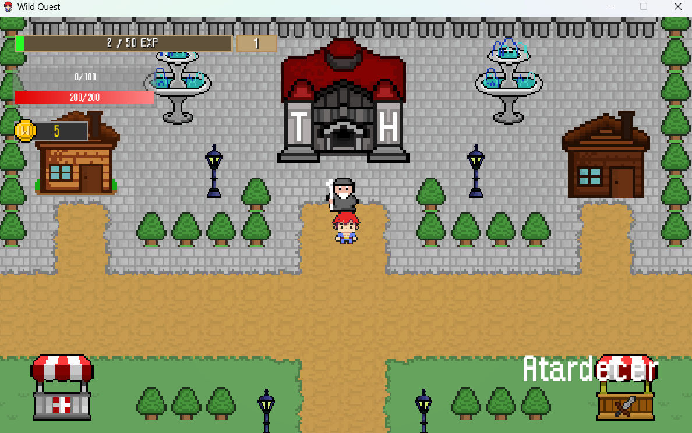
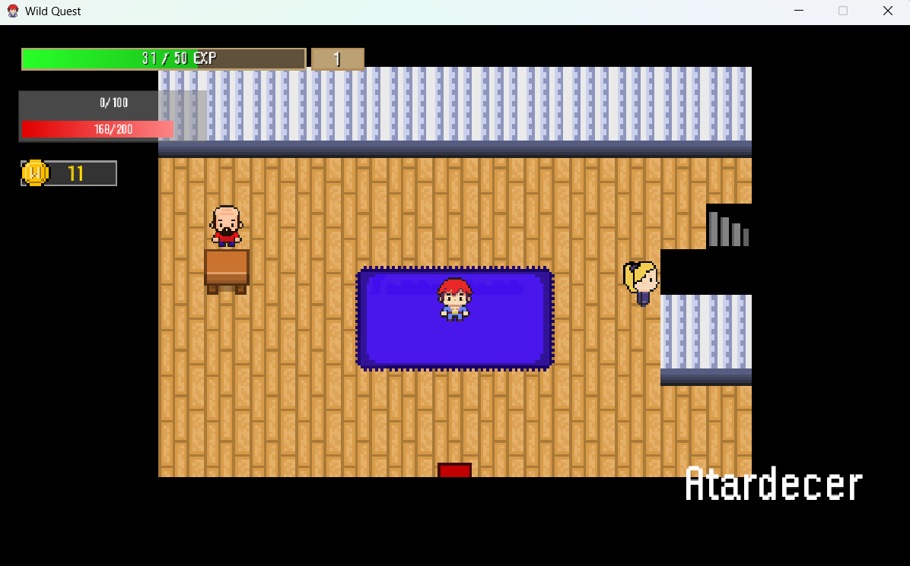
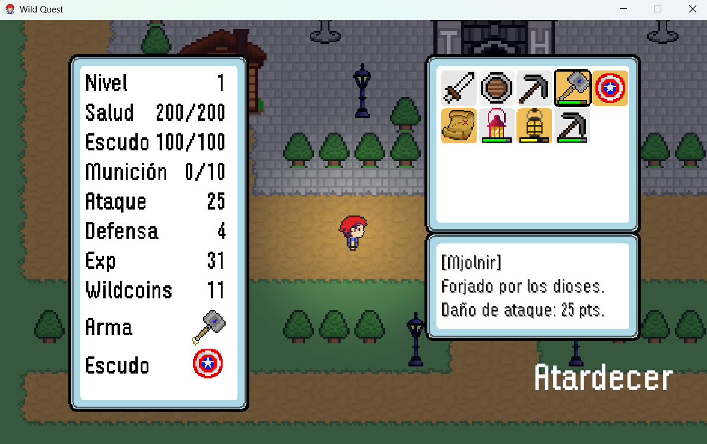
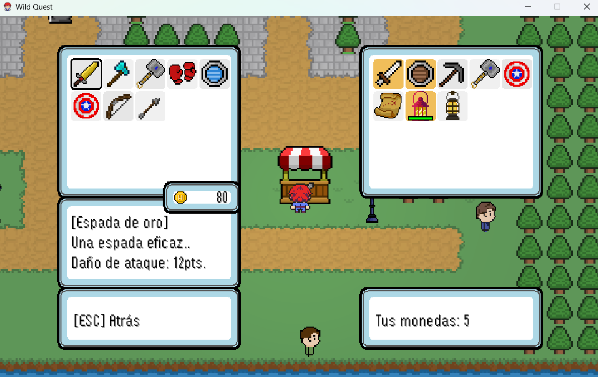
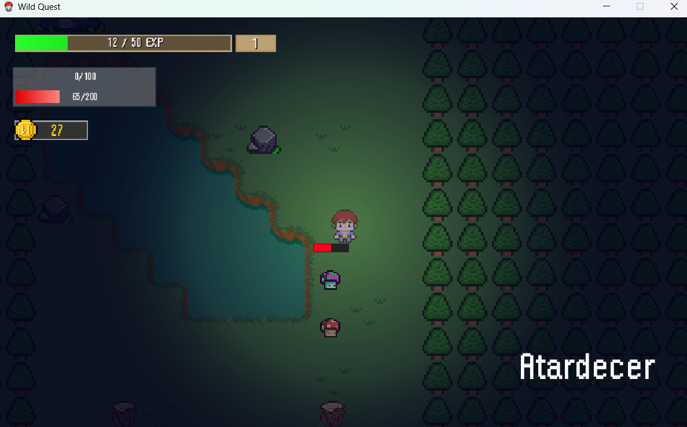
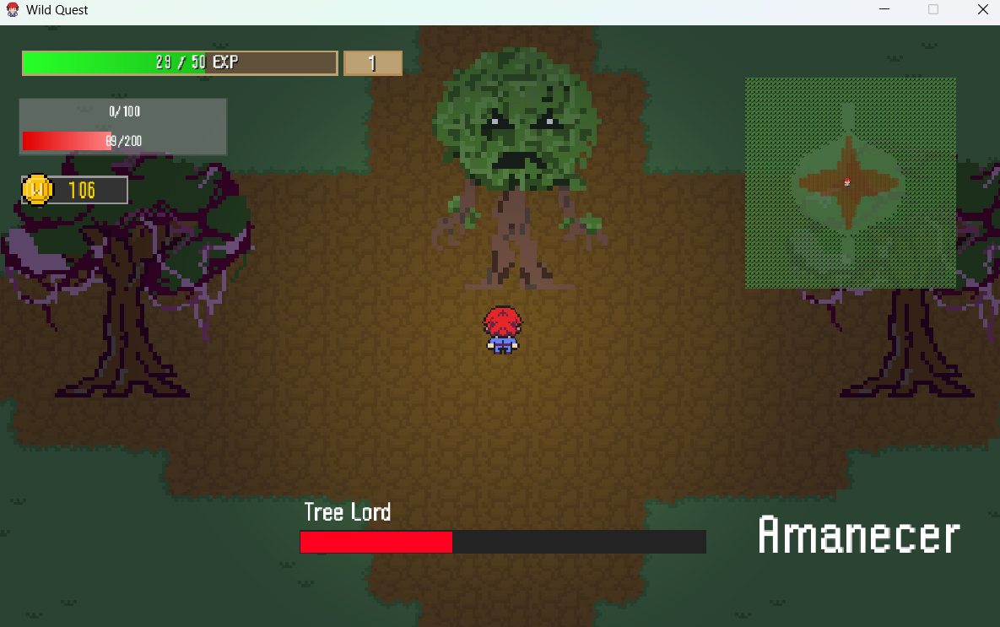
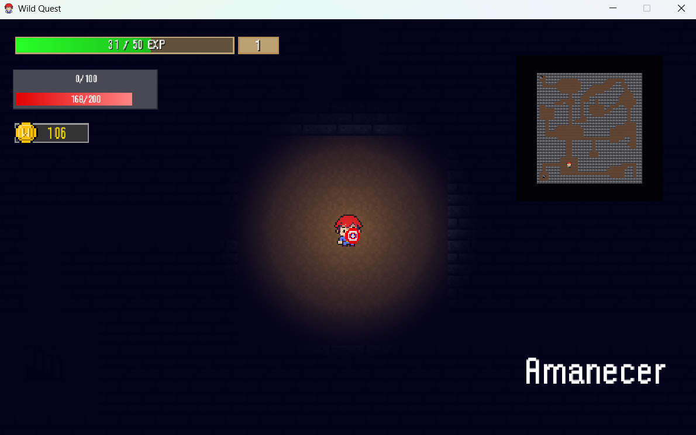

# WildQuest - Juego de Rol 2D en Java

**WildQuest** es un juego de rol desarrollado en Java que te llevará a un emocionante mundo de aventuras. En este repositorio encontrarás el código fuente del proyecto, así como instrucciones sobre cómo descargar y ejecutar el juego en tu PC.

Este proyecto está desarrollado utilizando Java y Maven, por lo que necesitarás tener configurado un **Java Runtime Environment (JRE)** para poder ejecutarlo correctamente.

---

## Índice

- [Requisitos](#requisitos)
- [Instrucciones para descargar y ejecutar](#instrucciones-para-descargar-y-ejecutar)
- [Galería de Imágenes](#galería-de-imágenes)
- [Opción alternativa - Descargar desde el sitio web](#opción-alternativa---descargar-desde-el-sitio-web)
- [Agradecimientos](#agradecimientos)
- [Licencia](#licencia)
- [Contacto](#contacto)

---

## Requisitos

Para ejecutar el juego, necesitarás tener instalado lo siguiente:

- **Java Runtime Environment (JRE)**, versión **8** o superior. Puedes descargarlo desde el sitio web oficial de Oracle o instalarlo a través de tu gestor de paquetes si usas Linux.


- **Java Development Kit (JDK)** (opcional, para desarrolladores), si deseas compilar el código fuente del proyecto.

Para verificar si tienes Java instalado, ejecuta el siguiente comando en tu terminal o línea de comandos:

```bash
java -version
```
Si obtienes una respuesta con una versión de Java 8 o superior, entonces estás listo para continuar.

--- 

## Instrucciones para descargar y ejecutar

### 1. Clona el repositorio:

Para obtener el proyecto en tu máquina local, abre tu terminal y ejecuta el siguiente comando:

```bash
git clone https://github.com/rramirezsoft/wildquest.git
```

### 2. Compila el proyecto (opcional):

Si deseas compilar el proyecto desde el código fuente, navega hasta la carpeta del proyecto y ejecuta el siguiente comando:

```bash
mvn clean package
```
Esto generará un archivo .jar ejecutable en la carpeta target/.

### 3. Ejecuta el juego:

Una vez que tengas el archivo .jar generado, puedes ejecutar el juego utilizando el siguiente comando en la terminal:

```bash
java -jar target/wildquest-1.0-SNAPSHOT-with-dependencies.jar
```
Si todo está correctamente configurado, el juego debería iniciarse y podrás comenzar a jugar.

---
## Galería de Imágenes

A continuación, se muestran algunas imágenes del juego WildQuest:

### Pantalla de inicio


### Diálogo inicial


### Batalla en el  Bosque Eldoria


### Pueblo Veridia


### Interior de casas


### Iventario del jugador


### Tradeo en el pueblo


### Envenenamiento por setas


### Lucha contra el jefe del bosque Eldoria


### Exploración de mazmorras


---

## Opción alternativa - Descargar desde el sitio web

Si prefieres no descargar el proyecto desde GitHub, también puedes acceder al proyecto a través de mi web.

Visita mi web [rramirezsoft.com](http://rramirezsoft.com).

- Visita la sección Portfolio en la página principal.
- Busca el proyecto WildQuest y haz click en el icono de descarga.

---

## Agradecimientos
Este proyecto ha sido desarrollado con pasión y dedicación, y se agradece todo el apoyo recibido de la comunidad y aquellos que ayudan a mejorar el juego.

Si tienes alguna sugerencia o encuentras un error, no dudes en abrir un issue o pull request.

---

## Licencia

Este proyecto está licenciado bajo la **Creative Commons Attribution-NonCommercial 4.0 International (CC BY-NC 4.0)**.  
Puedes copiar, distribuir y adaptar el contenido, siempre que se otorgue el crédito adecuado y no se utilice con fines comerciales.

Para más detalles sobre la licencia, consulta el archivo [`LICENSE`](./LICENSE) o visita:  
[https://creativecommons.org/licenses/by-nc/4.0/](https://creativecommons.org/licenses/by-nc/4.0/)

--- 
## Contacto

- GitHub: https://github.com/rramirezsoft
- Sitio Web: https://rramirezsoft.com
- Correo Electrónico: ramirezsoft@gmail.com

### ¡Gracias por tu apoyo y por jugar WildQuest, disfruta del juego!

